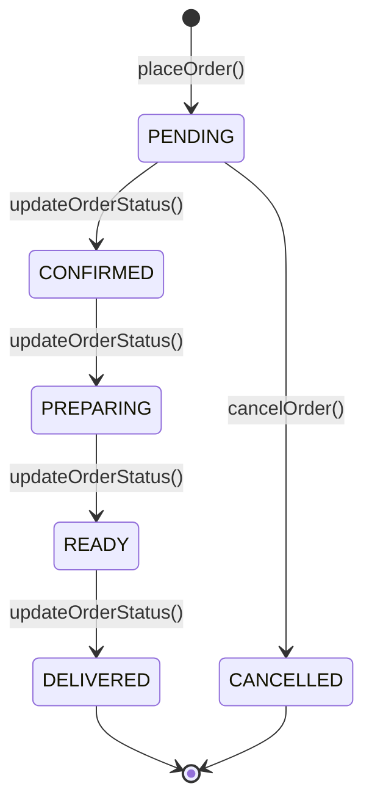
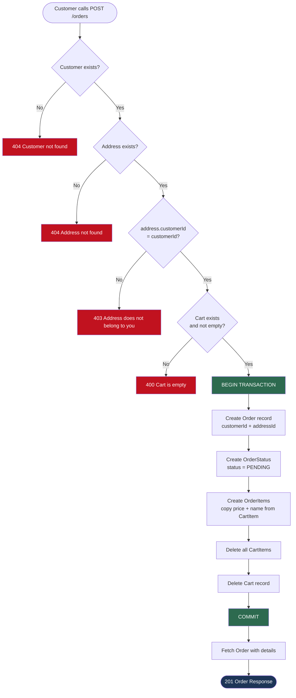
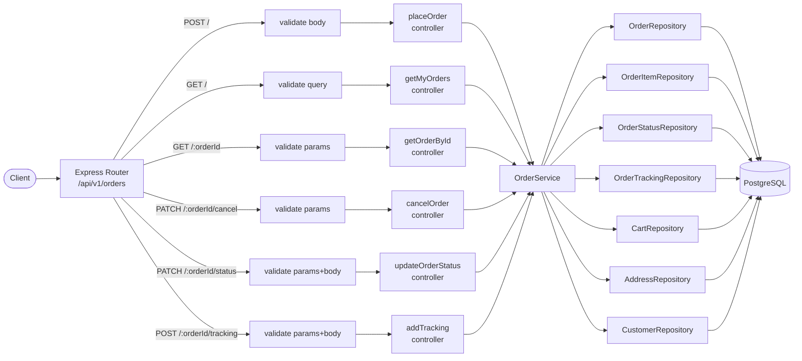
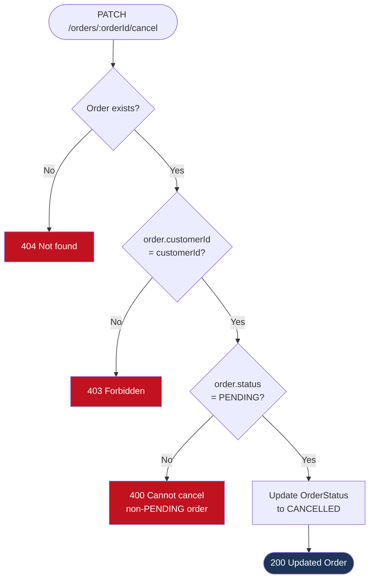
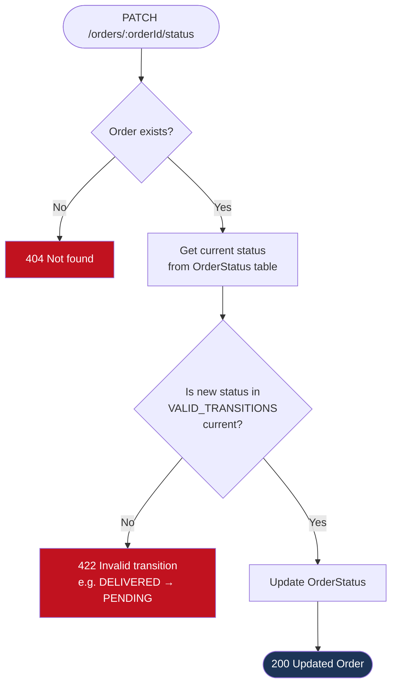

# Order Management — Implementation Plan

## Design Decisions

| القرار | الاختيار | السبب |
|--------|---------|-------|
| `OrderStatus` | جدول منفصل (1:1) | متوافق مع الـ old schema والـ modules الموجودة |
| `OrderTracking` | جدول منفصل (1:n) | متوافق مع الـ old schema والـ modules الموجودة |
| `OrderItem.price` + `name` | ✅ snapshot | الـ CartItem عنده snapshot، نـ copy منه مباشرة |
| `Order.restaurantId` | ❌ غير موجود | الـ old schema ما كانتش بتحتفظ به |
| `Order.totalAmount` | ❌ غير موجود | الـ old schema ما كانتش بتحتفظ به |
| Status valid values | String مع validation في الـ service | الـ old schema استخدم `String` مش enum |

---

## Step 1 — Prisma Schema

**File:** `prisma/schema.prisma`

### 1.1 إضافة `Order` model

```prisma
// ═══════════════════════════════════════════════════════════════
// Orders
// ═══════════════════════════════════════════════════════════════

model Order {
  id         String   @id @default(cuid())
  customerId String
  addressId  String
  orderDate  DateTime @default(now())

  customer Customer      @relation(fields: [customerId], references: [id], onDelete: Restrict)
  address  Address       @relation(fields: [addressId], references: [id], onDelete: Restrict)
  items    OrderItem[]
  status   OrderStatus?
  tracking OrderTracking[]

  createdAt DateTime @default(now())
  updatedAt DateTime @updatedAt

  @@index([customerId])
  @@index([addressId])
}
```

### 1.2 إضافة `OrderItem` model

```prisma
model OrderItem {
  id         String  @id @default(cuid())
  orderId    String
  menuItemId String
  quantity   Int
  price      Decimal
  name       String

  order    Order    @relation(fields: [orderId], references: [id], onDelete: Cascade)
  menuItem MenuItem @relation(fields: [menuItemId], references: [id], onDelete: Restrict)

  createdAt DateTime @default(now())
  updatedAt DateTime @updatedAt

  @@index([orderId])
  @@index([menuItemId])
}
```

> `price` و `name` بيتنسخوا من `CartItem` وقت إنشاء الـ order — مش live من `MenuItem`.

### 1.3 إضافة `OrderStatus` model

```prisma
model OrderStatus {
  orderId String @id
  status  String

  order Order @relation(fields: [orderId], references: [id], onDelete: Cascade)

  createdAt DateTime @default(now())
  updatedAt DateTime @updatedAt
}
```

> PK = FK — كل order عندها record واحد بالظبط في `OrderStatus`.

### 1.4 إضافة `OrderTracking` model

```prisma
model OrderTracking {
  id                    String   @id @default(cuid())
  orderId               String
  currentLocation       String
  estimatedDeliveryTime DateTime

  order Order @relation(fields: [orderId], references: [id], onDelete: Cascade)

  createdAt DateTime @default(now())
  updatedAt DateTime @updatedAt

  @@index([orderId])
}
```

### 1.5 Back-relations على الـ models الموجودة

```prisma
// في Customer — أضف:
orders Order[]

// في Address — أضف:
orders Order[]

// في MenuItem — أضف:
orderItems OrderItem[]
```

### 1.6 تشغيل الـ migration

```bash
npx prisma migrate dev --name add_order_management
```

---

## Step 2 — Repository Layer

### 2.1 `order.repository.ts`

**File:** `src/modules/order/order.repository.ts`

```typescript
import type { PrismaClient, Prisma } from "../../generated/prisma/client";
import { BaseRepository } from "../../shared/repositories/base.repository";
import prisma from "../../config/prisma";

export class OrderRepository extends BaseRepository<PrismaClient["order"]> {
  constructor() {
    super(prisma.order);
  }

  async findById(id: string) {
    return this.findUnique({ where: { id } });
  }

  async findByIdWithDetails(id: string) {
    return prisma.order.findUnique({
      where: { id },
      include: {
        items: { orderBy: { createdAt: "asc" } },
        status: true,
        tracking: { orderBy: { createdAt: "desc" } },
        address: true,
      },
    });
  }

  async findByCustomerIdPaginated(
    customerId: string,
    page: number,
    limit: number,
  ) {
    return this.findPaginated({
      page,
      limit,
      where: { customerId },
      include: {
        items: true,
        status: true,
      },
      orderBy: { createdAt: "desc" },
    });
  }

  async createOrder(
    data: Prisma.OrderUncheckedCreateInput,
    tx?: Prisma.TransactionClient,
  ) {
    return (tx ?? prisma).order.create({ data });
  }
}

export const orderRepository = new OrderRepository();
```

### 2.2 `orderItem.repository.ts`

**File:** `src/modules/orderItem/orderItem.repository.ts`

```typescript
import type { PrismaClient, Prisma } from "../../generated/prisma/client";
import { BaseRepository } from "../../shared/repositories/base.repository";
import prisma from "../../config/prisma";

export class OrderItemRepository extends BaseRepository<PrismaClient["orderItem"]> {
  constructor() {
    super(prisma.orderItem);
  }

  async findById(id: string) {
    return this.findUnique({ where: { id } });
  }

  async createManyWithTx(
    items: Prisma.OrderItemUncheckedCreateInput[],
    tx: Prisma.TransactionClient,
  ) {
    return tx.orderItem.createMany({ data: items });
  }
}

export const orderItemRepository = new OrderItemRepository();
```

### 2.3 `orderStatus.repository.ts`

**File:** `src/modules/orderStatus/orderStatus.repository.ts`

```typescript
import type { PrismaClient, Prisma } from "../../generated/prisma/client";
import { BaseRepository } from "../../shared/repositories/base.repository";
import prisma from "../../config/prisma";

export class OrderStatusRepository extends BaseRepository<PrismaClient["orderStatus"]> {
  constructor() {
    super(prisma.orderStatus);
  }

  async findByOrderId(orderId: string) {
    return this.findUnique({ where: { orderId } });
  }

  async createStatus(
    orderId: string,
    status: string,
    tx?: Prisma.TransactionClient,
  ) {
    return (tx ?? prisma).orderStatus.create({
      data: { orderId, status },
    });
  }

  async updateStatus(
    orderId: string,
    status: string,
    tx?: Prisma.TransactionClient,
  ) {
    return (tx ?? prisma).orderStatus.update({
      where: { orderId },
      data: { status },
    });
  }
}

export const orderStatusRepository = new OrderStatusRepository();
```

### 2.4 `orderTracking.repository.ts`

**File:** `src/modules/orderTracking/orderTracking.repository.ts`

```typescript
import type { PrismaClient, Prisma } from "../../generated/prisma/client";
import { BaseRepository } from "../../shared/repositories/base.repository";
import prisma from "../../config/prisma";

export class OrderTrackingRepository extends BaseRepository<PrismaClient["orderTracking"]> {
  constructor() {
    super(prisma.orderTracking);
  }

  async findById(id: string) {
    return this.findUnique({ where: { id } });
  }

  async findByOrderId(orderId: string) {
    return prisma.orderTracking.findMany({
      where: { orderId },
      orderBy: { createdAt: "desc" },
    });
  }

  async createTracking(
    data: Prisma.OrderTrackingUncheckedCreateInput,
    tx?: Prisma.TransactionClient,
  ) {
    return (tx ?? prisma).orderTracking.create({ data });
  }
}

export const orderTrackingRepository = new OrderTrackingRepository();
```

---

## Step 3 — Model Layer

### 3.1 `order.model.ts`

**File:** `src/modules/order/order.model.ts`

```typescript
import type {
  OrderModel,
  OrderItemModel,
  OrderStatusModel,
  OrderTrackingModel,
  AddressModel,
} from "../../generated/prisma/models";

export type OrderWithDetails = OrderModel & {
  items: Array<OrderItemModel>;
  status: OrderStatusModel | null;
  tracking: Array<OrderTrackingModel>;
  address: AddressModel;
};

export type OrderListItem = OrderModel & {
  items: Array<OrderItemModel>;
  status: OrderStatusModel | null;
};
```

### 3.2 `orderItem.model.ts`

**File:** `src/modules/orderItem/orderItem.model.ts`

```typescript
export type { OrderItemModel } from "../../generated/prisma/models";
```

### 3.3 `orderStatus.model.ts`

**File:** `src/modules/orderStatus/orderStatus.model.ts`

```typescript
export type { OrderStatusModel } from "../../generated/prisma/models";

export const ORDER_STATUSES = [
  "PENDING",
  "CONFIRMED",
  "PREPARING",
  "READY",
  "DELIVERED",
  "CANCELLED",
] as const;

export type OrderStatusValue = (typeof ORDER_STATUSES)[number];

export const VALID_TRANSITIONS: Record<OrderStatusValue, OrderStatusValue[]> = {
  PENDING:   ["CONFIRMED", "CANCELLED"],
  CONFIRMED: ["PREPARING"],
  PREPARING: ["READY"],
  READY:     ["DELIVERED"],
  DELIVERED: [],
  CANCELLED: [],
};
```

### 3.4 `orderTracking.model.ts`

**File:** `src/modules/orderTracking/orderTracking.model.ts`

```typescript
export type { OrderTrackingModel } from "../../generated/prisma/models";
```

---

## Step 4 — Validation Layer

**File:** `src/modules/order/order.validation.ts`

```typescript
import { z } from "zod";
import { schemaRegistry } from "../../openapi/registry";
import { ORDER_STATUSES } from "../orderStatus/orderStatus.model";

// ═══════════════════════════════════════════════════════════════
// Request Schemas
// ═══════════════════════════════════════════════════════════════

export const PlaceOrderRequestSchema = z
  .object({
    addressId: z.cuid2().meta({
      description: "Delivery address ID (must belong to the customer)",
      example: "clxyz...",
    }),
  })
  .meta({
    id: "PlaceOrderRequest",
    description: "Payload to place an order from the active cart",
  });

export const UpdateOrderStatusRequestSchema = z
  .object({
    status: z
      .enum(["CONFIRMED", "PREPARING", "READY", "DELIVERED"] as const)
      .meta({ description: "New order status (excludes CANCELLED — use /cancel endpoint)" }),
  })
  .meta({ id: "UpdateOrderStatusRequest" });

export const AddOrderTrackingRequestSchema = z
  .object({
    currentLocation: z.string().min(1).meta({
      description: "Current location description",
      example: "Out for delivery — Nasr City",
    }),
    estimatedDeliveryTime: z.iso.datetime().meta({
      description: "Estimated delivery time (ISO 8601)",
      example: "2026-05-03T14:30:00.000Z",
    }),
  })
  .meta({ id: "AddOrderTrackingRequest" });

export const OrderIdParamsSchema = z
  .object({
    orderId: z.cuid2().meta({ description: "Order ID" }),
  })
  .meta({ id: "OrderIdParams" });

// ═══════════════════════════════════════════════════════════════
// Response Schemas
// ═══════════════════════════════════════════════════════════════

export const OrderItemResponseSchema = z
  .object({
    id: z.cuid2(),
    menuItemId: z.cuid2(),
    name: z.string(),
    price: z.number(),
    quantity: z.number().int().positive(),
    createdAt: z.iso.datetime(),
    updatedAt: z.iso.datetime(),
  })
  .meta({ id: "OrderItemResponse" });

export const OrderStatusResponseSchema = z
  .object({
    status: z.enum(ORDER_STATUSES),
    createdAt: z.iso.datetime(),
    updatedAt: z.iso.datetime(),
  })
  .meta({ id: "OrderStatusResponse" });

export const OrderTrackingResponseSchema = z
  .object({
    id: z.cuid2(),
    currentLocation: z.string(),
    estimatedDeliveryTime: z.iso.datetime(),
    createdAt: z.iso.datetime(),
  })
  .meta({ id: "OrderTrackingResponse" });

export const OrderResponseSchema = z
  .object({
    id: z.cuid2(),
    customerId: z.cuid2(),
    addressId: z.cuid2(),
    address: z.object({
      id: z.cuid2(),
      addressLine1: z.string(),
      addressLine2: z.string().nullable(),
      city: z.string(),
      postalCode: z.string(),
      country: z.string(),
    }),
    orderDate: z.iso.datetime(),
    status: OrderStatusResponseSchema.nullable(),
    items: z.array(OrderItemResponseSchema),
    tracking: z.array(OrderTrackingResponseSchema),
    createdAt: z.iso.datetime(),
    updatedAt: z.iso.datetime(),
  })
  .meta({ id: "OrderResponse" });

export const OrderListItemResponseSchema = z
  .object({
    id: z.cuid2(),
    customerId: z.cuid2(),
    addressId: z.cuid2(),
    orderDate: z.iso.datetime(),
    status: OrderStatusResponseSchema.nullable(),
    itemCount: z.number().int(),
    createdAt: z.iso.datetime(),
    updatedAt: z.iso.datetime(),
  })
  .meta({ id: "OrderListItemResponse" });

export const OrderSuccessResponseSchema = z
  .object({ success: z.literal(true), data: OrderResponseSchema })
  .meta({ id: "OrderSuccessResponse" });

export const OrderListSuccessResponseSchema = z
  .object({
    success: z.literal(true),
    data: z.array(OrderListItemResponseSchema),
    meta: z.object({
      page: z.number(),
      limit: z.number(),
      total: z.number(),
      totalPages: z.number(),
    }),
  })
  .meta({ id: "OrderListSuccessResponse" });

// ═══════════════════════════════════════════════════════════════
// Registry
// ═══════════════════════════════════════════════════════════════

schemaRegistry.register("PlaceOrderRequest", PlaceOrderRequestSchema);
schemaRegistry.register("UpdateOrderStatusRequest", UpdateOrderStatusRequestSchema);
schemaRegistry.register("AddOrderTrackingRequest", AddOrderTrackingRequestSchema);
schemaRegistry.register("OrderIdParams", OrderIdParamsSchema);
schemaRegistry.register("OrderItemResponse", OrderItemResponseSchema);
schemaRegistry.register("OrderStatusResponse", OrderStatusResponseSchema);
schemaRegistry.register("OrderTrackingResponse", OrderTrackingResponseSchema);
schemaRegistry.register("OrderResponse", OrderResponseSchema);
schemaRegistry.register("OrderListItemResponse", OrderListItemResponseSchema);
schemaRegistry.register("OrderSuccessResponse", OrderSuccessResponseSchema);
schemaRegistry.register("OrderListSuccessResponse", OrderListSuccessResponseSchema);

// ═══════════════════════════════════════════════════════════════
// TypeScript Types
// ═══════════════════════════════════════════════════════════════

export type PlaceOrderInput = z.infer<typeof PlaceOrderRequestSchema>;
export type UpdateOrderStatusInput = z.infer<typeof UpdateOrderStatusRequestSchema>;
export type AddOrderTrackingInput = z.infer<typeof AddOrderTrackingRequestSchema>;
export type OrderIdParams = z.infer<typeof OrderIdParamsSchema>;
export type OrderResponse = z.infer<typeof OrderResponseSchema>;
export type OrderListItemResponse = z.infer<typeof OrderListItemResponseSchema>;
```

---

## Step 5 — Service Layer

**File:** `src/modules/order/order.service.ts`

```typescript
import { StatusCodes } from "http-status-codes";
import { AppError } from "../../middlewares/error.middleware";
import { customerRepository } from "../customer/customer.repository";
import { addressRepository } from "../address/address.repository";
import { cartRepository } from "../cart/cart.repository";
import { orderRepository } from "./order.repository";
import { orderItemRepository } from "../orderItem/orderItem.repository";
import { orderStatusRepository } from "../orderStatus/orderStatus.repository";
import { orderTrackingRepository } from "../orderTracking/orderTracking.repository";
import { VALID_TRANSITIONS } from "../orderStatus/orderStatus.model";
import type {
  PlaceOrderInput,
  UpdateOrderStatusInput,
  AddOrderTrackingInput,
  OrderResponse,
  OrderListItemResponse,
} from "./order.validation";
import type { OrderWithDetails, OrderListItem } from "./order.model";
import type { PaginationQuery } from "../../shared/schemas/pagination.schema";

class OrderService {

  // ─── Place Order ──────────────────────────────────────────────
  async placeOrder(customerId: string, input: PlaceOrderInput): Promise<OrderResponse> {
    await this.assertCustomerExists(customerId);

    // 1. تحقق إن الـ address بتاع العميل نفسه
    const address = await addressRepository.findById(input.addressId);
    if (!address) {
      throw new AppError("Address not found", StatusCodes.NOT_FOUND);
    }
    if (address.customerId !== customerId) {
      throw new AppError("This address does not belong to you", StatusCodes.FORBIDDEN);
    }

    // 2. جيب الـ cart مع الـ items
    const cart = await cartRepository.findByCustomerIdWithItems(customerId);
    if (!cart || cart.items.length === 0) {
      throw new AppError("Your cart is empty", StatusCodes.BAD_REQUEST);
    }

    // 3. إنشاء كل حاجة في transaction واحدة
    let createdOrderId: string;

    await orderRepository.transaction(async (tx) => {
      // 3a. إنشاء الـ Order
      const order = await orderRepository.createOrder(
        { customerId, addressId: input.addressId },
        tx,
      );
      createdOrderId = order.id;

      // 3b. إنشاء الـ OrderStatus بـ PENDING
      await orderStatusRepository.createStatus(order.id, "PENDING", tx);

      // 3c. إنشاء الـ OrderItems — copy price و name من CartItem
      await orderItemRepository.createManyWithTx(
        cart.items.map((item) => ({
          orderId: order.id,
          menuItemId: item.menuItemId,
          quantity: item.quantity,
          price: item.price,   // snapshot من CartItem
          name: item.name,     // snapshot من CartItem
        })),
        tx,
      );

      // 3d. مسح الـ CartItems
      await tx.cartItem.deleteMany({ where: { cartId: cart.id } });

      // 3e. حذف الـ Cart نفسها (هتتعمل من جديد أول ما العميل يضيف item)
      await tx.cart.delete({ where: { id: cart.id } });
    });

    const order = await orderRepository.findByIdWithDetails(createdOrderId!);
    if (!order) throw new AppError("Order not found after creation", StatusCodes.INTERNAL_SERVER_ERROR);
    return this.toOrderResponse(order);
  }

  // ─── Get My Orders ────────────────────────────────────────────
  async getMyOrders(
    customerId: string,
    pagination: PaginationQuery,
  ): Promise<{ data: OrderListItemResponse[]; meta: object }> {
    await this.assertCustomerExists(customerId);

    const result = await orderRepository.findByCustomerIdPaginated(
      customerId,
      pagination.page,
      pagination.limit,
    );

    return {
      data: result.data.map((order) => this.toOrderListItemResponse(order as OrderListItem)),
      meta: result.meta,
    };
  }

  // ─── Get Order By ID ──────────────────────────────────────────
  async getOrderById(customerId: string, orderId: string): Promise<OrderResponse> {
    const order = await orderRepository.findByIdWithDetails(orderId);

    if (!order) {
      throw new AppError("Order not found", StatusCodes.NOT_FOUND);
    }
    if (order.customerId !== customerId) {
      throw new AppError("This order does not belong to you", StatusCodes.FORBIDDEN);
    }

    return this.toOrderResponse(order as OrderWithDetails);
  }

  // ─── Cancel Order ─────────────────────────────────────────────
  async cancelOrder(customerId: string, orderId: string): Promise<OrderResponse> {
    const order = await orderRepository.findByIdWithDetails(orderId);

    if (!order) {
      throw new AppError("Order not found", StatusCodes.NOT_FOUND);
    }
    if (order.customerId !== customerId) {
      throw new AppError("This order does not belong to you", StatusCodes.FORBIDDEN);
    }
    if (order.status?.status !== "PENDING") {
      throw new AppError(
        "Only PENDING orders can be cancelled",
        StatusCodes.BAD_REQUEST,
      );
    }

    await orderStatusRepository.updateStatus(orderId, "CANCELLED");

    const updated = await orderRepository.findByIdWithDetails(orderId);
    return this.toOrderResponse(updated as OrderWithDetails);
  }

  // ─── Update Order Status (admin/restaurant) ───────────────────
  async updateOrderStatus(
    orderId: string,
    input: UpdateOrderStatusInput,
  ): Promise<OrderResponse> {
    const order = await orderRepository.findByIdWithDetails(orderId);

    if (!order) {
      throw new AppError("Order not found", StatusCodes.NOT_FOUND);
    }

    const currentStatus = order.status?.status as keyof typeof VALID_TRANSITIONS | undefined;
    if (!currentStatus) {
      throw new AppError("Order has no status record", StatusCodes.INTERNAL_SERVER_ERROR);
    }

    const allowed = VALID_TRANSITIONS[currentStatus];
    if (!allowed.includes(input.status as any)) {
      throw new AppError(
        `Cannot transition from ${currentStatus} to ${input.status}`,
        StatusCodes.UNPROCESSABLE_ENTITY,
      );
    }

    await orderStatusRepository.updateStatus(orderId, input.status);

    const updated = await orderRepository.findByIdWithDetails(orderId);
    return this.toOrderResponse(updated as OrderWithDetails);
  }

  // ─── Add Tracking Update ──────────────────────────────────────
  async addTracking(
    orderId: string,
    input: AddOrderTrackingInput,
  ): Promise<OrderResponse> {
    const order = await orderRepository.findById(orderId);
    if (!order) {
      throw new AppError("Order not found", StatusCodes.NOT_FOUND);
    }

    await orderTrackingRepository.createTracking({
      orderId,
      currentLocation: input.currentLocation,
      estimatedDeliveryTime: new Date(input.estimatedDeliveryTime),
    });

    const updated = await orderRepository.findByIdWithDetails(orderId);
    return this.toOrderResponse(updated as OrderWithDetails);
  }

  // ─── Private Helpers ──────────────────────────────────────────

  private async assertCustomerExists(customerId: string): Promise<void> {
    const customer = await customerRepository.findById(customerId);
    if (!customer) {
      throw new AppError("Customer not found", StatusCodes.NOT_FOUND);
    }
  }

  private toOrderResponse(order: OrderWithDetails): OrderResponse {
    return {
      id: order.id,
      customerId: order.customerId,
      addressId: order.addressId,
      address: {
        id: order.address.id,
        addressLine1: order.address.addressLine1,
        addressLine2: order.address.addressLine2 ?? null,
        city: order.address.city,
        postalCode: order.address.postalCode,
        country: order.address.country,
      },
      orderDate: order.orderDate.toISOString(),
      status: order.status
        ? {
            status: order.status.status as any,
            createdAt: order.status.createdAt.toISOString(),
            updatedAt: order.status.updatedAt.toISOString(),
          }
        : null,
      items: order.items.map((item) => ({
        id: item.id,
        menuItemId: item.menuItemId,
        name: item.name,
        price: Number(item.price),
        quantity: item.quantity,
        createdAt: item.createdAt.toISOString(),
        updatedAt: item.updatedAt.toISOString(),
      })),
      tracking: order.tracking.map((t) => ({
        id: t.id,
        currentLocation: t.currentLocation,
        estimatedDeliveryTime: t.estimatedDeliveryTime.toISOString(),
        createdAt: t.createdAt.toISOString(),
      })),
      createdAt: order.createdAt.toISOString(),
      updatedAt: order.updatedAt.toISOString(),
    };
  }

  private toOrderListItemResponse(order: OrderListItem): OrderListItemResponse {
    return {
      id: order.id,
      customerId: order.customerId,
      addressId: order.addressId,
      orderDate: order.orderDate.toISOString(),
      status: order.status
        ? {
            status: order.status.status as any,
            createdAt: order.status.createdAt.toISOString(),
            updatedAt: order.status.updatedAt.toISOString(),
          }
        : null,
      itemCount: order.items.length,
      createdAt: order.createdAt.toISOString(),
      updatedAt: order.updatedAt.toISOString(),
    };
  }
}

export const orderService = new OrderService();
```

---

## Step 6 — Controller Layer

**File:** `src/modules/order/order.controller.ts`

```typescript
import type { Request, Response } from "express";
import { StatusCodes } from "http-status-codes";
import { asyncHandler } from "../../utils/asyncHandler";
import { orderService } from "./order.service";
import type { OrderIdParams } from "./order.validation";

// TODO: Replace with `req.customer.id` once auth is implemented.
const getCurrentCustomerId = (_req: Request): string => {
  const id = process.env.TEST_CUSTOMER_ID;
  if (!id) {
    throw new Error("TEST_CUSTOMER_ID is not set in .env");
  }
  return id;
};

export const placeOrder = asyncHandler(
  async (req: Request, res: Response): Promise<void> => {
    const customerId = getCurrentCustomerId(req);
    const order = await orderService.placeOrder(customerId, req.body);
    res.status(StatusCodes.CREATED).json({ success: true, data: order });
  },
);

export const getMyOrders = asyncHandler(
  async (req: Request, res: Response): Promise<void> => {
    const customerId = getCurrentCustomerId(req);
    const result = await orderService.getMyOrders(customerId, req.query as any);
    res.status(StatusCodes.OK).json({ success: true, ...result });
  },
);

export const getOrderById = asyncHandler(
  async (req: Request<OrderIdParams>, res: Response): Promise<void> => {
    const customerId = getCurrentCustomerId(req);
    const order = await orderService.getOrderById(customerId, req.params.orderId);
    res.status(StatusCodes.OK).json({ success: true, data: order });
  },
);

export const cancelOrder = asyncHandler(
  async (req: Request<OrderIdParams>, res: Response): Promise<void> => {
    const customerId = getCurrentCustomerId(req);
    const order = await orderService.cancelOrder(customerId, req.params.orderId);
    res.status(StatusCodes.OK).json({ success: true, data: order });
  },
);

export const updateOrderStatus = asyncHandler(
  async (req: Request<OrderIdParams>, res: Response): Promise<void> => {
    const order = await orderService.updateOrderStatus(req.params.orderId, req.body);
    res.status(StatusCodes.OK).json({ success: true, data: order });
  },
);

export const addTracking = asyncHandler(
  async (req: Request<OrderIdParams>, res: Response): Promise<void> => {
    const order = await orderService.addTracking(req.params.orderId, req.body);
    res.status(StatusCodes.CREATED).json({ success: true, data: order });
  },
);
```

---

## Step 7 — Routes Layer

**File:** `src/modules/order/order.routes.ts`

```typescript
import { Router } from "express";
import { validate } from "../../middlewares/validate.middleware";
import { routeRegistry } from "../../openapi/registry";
import * as controller from "./order.controller";
import {
  PlaceOrderRequestSchema,
  UpdateOrderStatusRequestSchema,
  AddOrderTrackingRequestSchema,
  OrderIdParamsSchema,
} from "./order.validation";
import { PaginationQuerySchema } from "../../shared/schemas/pagination.schema";

const router: Router = Router();

// ─── Handlers ────────────────────────────────────────────

router.post("/", validate({ body: PlaceOrderRequestSchema }), controller.placeOrder);

router.get("/", validate({ query: PaginationQuerySchema }), controller.getMyOrders);

router.get("/:orderId", validate({ params: OrderIdParamsSchema }), controller.getOrderById);

router.patch("/:orderId/cancel", validate({ params: OrderIdParamsSchema }), controller.cancelOrder);

router.patch(
  "/:orderId/status",
  validate({ params: OrderIdParamsSchema, body: UpdateOrderStatusRequestSchema }),
  controller.updateOrderStatus,
);

router.post(
  "/:orderId/tracking",
  validate({ params: OrderIdParamsSchema, body: AddOrderTrackingRequestSchema }),
  controller.addTracking,
);

// ─── OpenAPI Documentation ───────────────────────────────

const tag = "Orders";
const errorRef = { $ref: "#/components/schemas/ErrorResponse" };
const validationErrorRef = { $ref: "#/components/schemas/ValidationErrorResponse" };

routeRegistry.push({
  path: "/api/v1/orders",
  pathItem: {
    post: {
      tags: [tag],
      summary: "Place an order from the active cart",
      requestBody: {
        required: true,
        content: {
          "application/json": {
            schema: { $ref: "#/components/schemas/PlaceOrderRequest" },
          },
        },
      },
      responses: {
        "201": {
          description: "Order placed successfully",
          content: {
            "application/json": {
              schema: { $ref: "#/components/schemas/OrderSuccessResponse" },
            },
          },
        },
        "400": { description: "Cart is empty", content: { "application/json": { schema: errorRef } } },
        "403": { description: "Address does not belong to you", content: { "application/json": { schema: errorRef } } },
        "404": { description: "Address or customer not found", content: { "application/json": { schema: errorRef } } },
      },
    },
    get: {
      tags: [tag],
      summary: "Get my orders (paginated)",
      parameters: [
        { name: "page", in: "query", schema: { type: "integer", default: 1 } },
        { name: "limit", in: "query", schema: { type: "integer", default: 10 } },
      ],
      responses: {
        "200": {
          description: "Orders retrieved successfully",
          content: {
            "application/json": {
              schema: { $ref: "#/components/schemas/OrderListSuccessResponse" },
            },
          },
        },
      },
    },
  },
});

routeRegistry.push({
  path: "/api/v1/orders/{orderId}",
  pathItem: {
    get: {
      tags: [tag],
      summary: "Get a single order with full details",
      parameters: [
        { name: "orderId", in: "path", required: true, schema: { type: "string" } },
      ],
      responses: {
        "200": {
          description: "Order retrieved successfully",
          content: {
            "application/json": {
              schema: { $ref: "#/components/schemas/OrderSuccessResponse" },
            },
          },
        },
        "403": { description: "Order does not belong to you", content: { "application/json": { schema: errorRef } } },
        "404": { description: "Order not found", content: { "application/json": { schema: errorRef } } },
      },
    },
  },
});

routeRegistry.push({
  path: "/api/v1/orders/{orderId}/cancel",
  pathItem: {
    patch: {
      tags: [tag],
      summary: "Cancel an order (PENDING only)",
      parameters: [
        { name: "orderId", in: "path", required: true, schema: { type: "string" } },
      ],
      responses: {
        "200": {
          description: "Order cancelled",
          content: {
            "application/json": {
              schema: { $ref: "#/components/schemas/OrderSuccessResponse" },
            },
          },
        },
        "400": { description: "Order is not PENDING", content: { "application/json": { schema: errorRef } } },
        "403": { description: "Order does not belong to you", content: { "application/json": { schema: errorRef } } },
        "404": { description: "Order not found", content: { "application/json": { schema: errorRef } } },
      },
    },
  },
});

routeRegistry.push({
  path: "/api/v1/orders/{orderId}/status",
  pathItem: {
    patch: {
      tags: [tag],
      summary: "Update order status (admin/restaurant)",
      parameters: [
        { name: "orderId", in: "path", required: true, schema: { type: "string" } },
      ],
      requestBody: {
        required: true,
        content: {
          "application/json": {
            schema: { $ref: "#/components/schemas/UpdateOrderStatusRequest" },
          },
        },
      },
      responses: {
        "200": {
          description: "Status updated",
          content: {
            "application/json": {
              schema: { $ref: "#/components/schemas/OrderSuccessResponse" },
            },
          },
        },
        "400": { description: "Validation error", content: { "application/json": { schema: validationErrorRef } } },
        "404": { description: "Order not found", content: { "application/json": { schema: errorRef } } },
        "422": { description: "Invalid status transition", content: { "application/json": { schema: errorRef } } },
      },
    },
  },
});

routeRegistry.push({
  path: "/api/v1/orders/{orderId}/tracking",
  pathItem: {
    post: {
      tags: [tag],
      summary: "Add a tracking update to an order",
      parameters: [
        { name: "orderId", in: "path", required: true, schema: { type: "string" } },
      ],
      requestBody: {
        required: true,
        content: {
          "application/json": {
            schema: { $ref: "#/components/schemas/AddOrderTrackingRequest" },
          },
        },
      },
      responses: {
        "201": {
          description: "Tracking update added",
          content: {
            "application/json": {
              schema: { $ref: "#/components/schemas/OrderSuccessResponse" },
            },
          },
        },
        "404": { description: "Order not found", content: { "application/json": { schema: errorRef } } },
      },
    },
  },
});

export default router;
```

---

## Step 8 — Wire Up

### 8.1 `src/routes/index.ts`

```typescript
import { Router } from "express";
import cartRouter from "../modules/cart/cart.routes";
import orderRouter from "../modules/order/order.routes";  // ← أضف

const router: Router = Router();

router.use("/carts", cartRouter);
router.use("/orders", orderRouter);  // ← أضف

export default router;
```

### 8.2 `src/openapi/document.ts`

```typescript
// أضف هذا السطر مع الـ imports الموجودة
import "../modules/order/order.validation";
```

---

## Step 9 — Status Transitions Reference

```
PENDING ──→ CONFIRMED ──→ PREPARING ──→ READY ──→ DELIVERED
   │
   └──→ CANCELLED

DELIVERED → ❌ (terminal)
CANCELLED → ❌ (terminal)
```

| من | إلى (مسموح) |
|----|------------|
| PENDING | CONFIRMED, CANCELLED |
| CONFIRMED | PREPARING |
| PREPARING | READY |
| READY | DELIVERED |
| DELIVERED | — |
| CANCELLED | — |

> CANCELLED عبر `/cancel` endpoint فقط (customer).  
> CONFIRMED → DELIVERED عبر `/status` endpoint (admin/restaurant).

---

## Flowcharts

### Order Lifecycle — Status Transitions



---

### placeOrder — Transaction Flow



---

### API Endpoints — Request Flow



---

### cancelOrder — Flow



---

### updateOrderStatus — Transition Validation



---

## Implementation Order (ترتيب التنفيذ)

```
1. prisma/schema.prisma          ← إضافة 4 models + back-relations
2. npx prisma migrate dev        ← توليد الـ migration + regenerate types
3. order.repository.ts           ← uncomment + add methods
4. orderItem.repository.ts       ← uncomment + add createManyWithTx
5. orderStatus.repository.ts     ← uncomment + add createStatus/updateStatus
6. orderTracking.repository.ts   ← uncomment + add createTracking/findByOrderId
7. order.model.ts                ← OrderWithDetails, OrderListItem types
8. orderItem.model.ts            ← re-export type
9. orderStatus.model.ts          ← re-export type + ORDER_STATUSES + VALID_TRANSITIONS
10. orderTracking.model.ts       ← re-export type
11. order.validation.ts          ← Zod schemas + registry + TS types
12. order.service.ts             ← business logic
13. order.controller.ts          ← asyncHandler handlers
14. order.routes.ts              ← router + OpenAPI docs
15. src/routes/index.ts          ← mount /orders
16. src/openapi/document.ts      ← import order.validation
17. npx tsc --noEmit             ← verify no type errors
```

---

## Files Summary

### ملفات تتعدّل (5 ملفات)
| الملف | التعديل |
|-------|---------|
| `prisma/schema.prisma` | إضافة 4 models + back-relations |
| `src/modules/order/order.model.ts` | إضافة type aliases |
| `src/routes/index.ts` | mount `/orders` |
| `src/openapi/document.ts` | import `order.validation` |
| `src/modules/orderItem/orderItem.model.ts` | re-export type |

### ملفات تتفعّل (uncomment + extend) (4 ملفات)
| الملف | الإضافات |
|-------|---------|
| `src/modules/order/order.repository.ts` | `findByIdWithDetails`, `findByCustomerIdPaginated`, `createOrder` |
| `src/modules/orderItem/orderItem.repository.ts` | `createManyWithTx` |
| `src/modules/orderStatus/orderStatus.repository.ts` | `createStatus`, `updateStatus` |
| `src/modules/orderTracking/orderTracking.repository.ts` | `createTracking`, `findByOrderId` |

### ملفات جديدة (4 ملفات)
| الملف | المحتوى |
|-------|---------|
| `src/modules/order/order.validation.ts` | Zod schemas + registry + TS types |
| `src/modules/order/order.service.ts` | business logic (placeOrder atomic transaction) |
| `src/modules/order/order.controller.ts` | asyncHandler handlers |
| `src/modules/order/order.routes.ts` | router + OpenAPI docs |
| `src/modules/orderStatus/orderStatus.model.ts` | ORDER_STATUSES + VALID_TRANSITIONS |
| `src/modules/orderTracking/orderTracking.model.ts` | re-export type |
