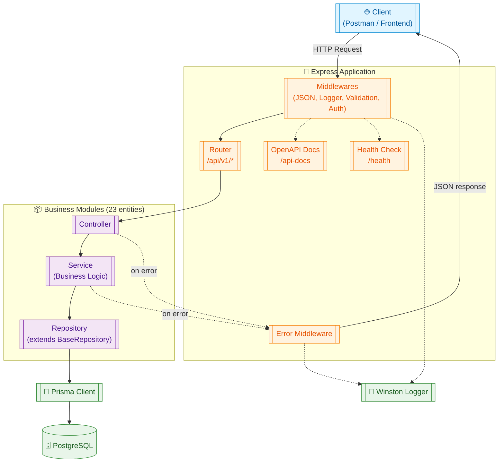
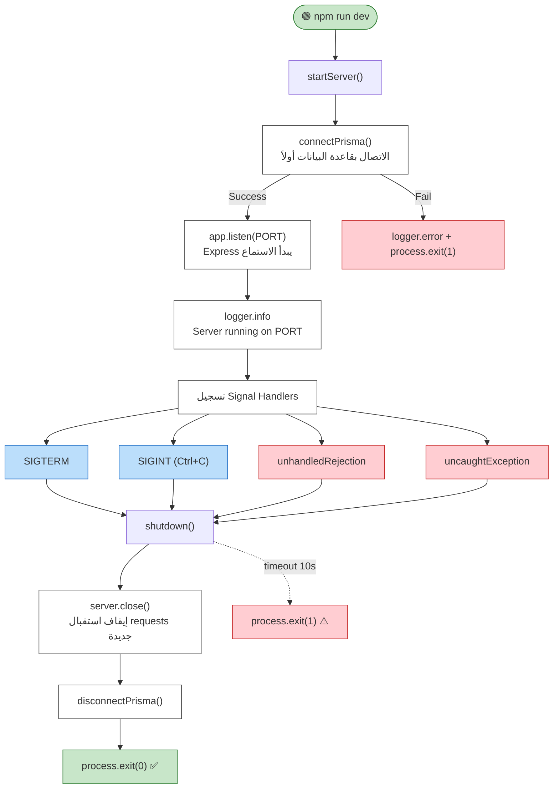
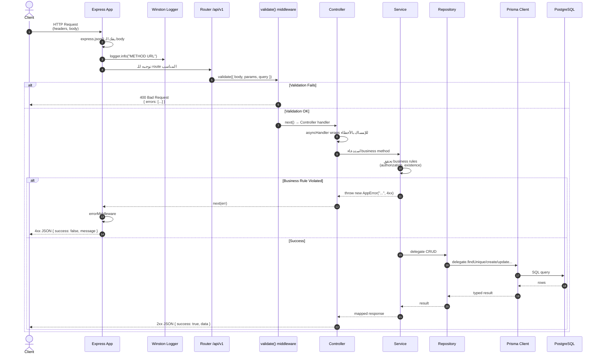
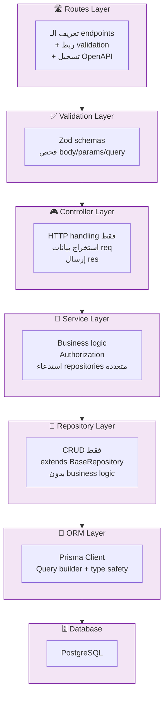
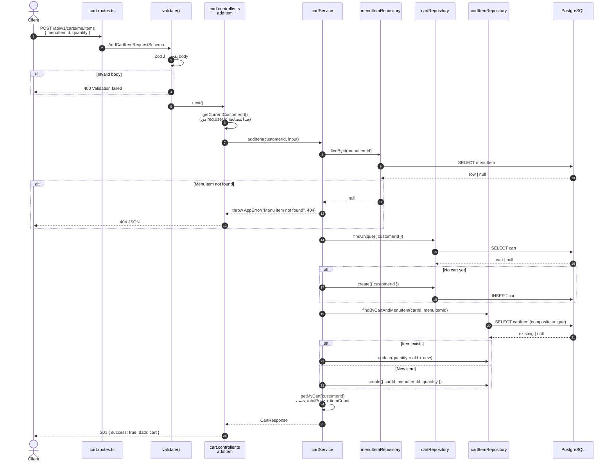
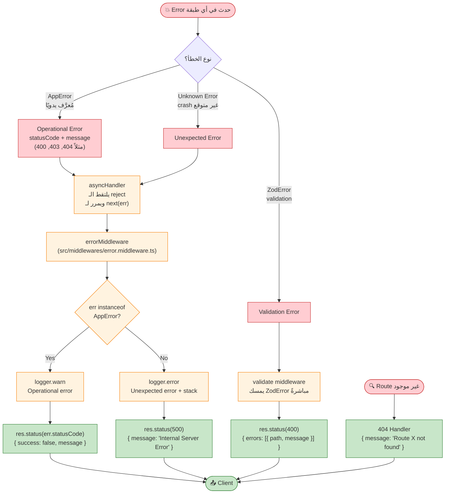

# Architecture & Flow Guide

> دليل بصري يشرح كيف يعمل المشروع من البداية إلى النهاية. مُوجَّه لأي مطور جديد يريد فهم البنية ودورة حياة أي Request خلال دقائق.

---

## 1. Overview

**Food Delivery API** — REST API مبني بـ:

| Layer      | Tech                              |
| ---------- | --------------------------------- |
| Runtime    | Node.js 25.8.1                    |
| Framework  | Express 5                         |
| Language   | TypeScript 6                      |
| ORM        | Prisma 7                          |
| Database   | PostgreSQL 17                     |
| Validation | Zod                               |
| API Docs   | OpenAPI 3.1 (Scalar + Swagger UI) |
| Logging    | Winston                           |

**النمط المعماري:** Layered Modular Architecture — كل موديول (entity) فولدر مستقل يحتوي نفس الـ 6 ملفات (routes, validation, controller, service, repository, model)، وكل طبقة لها مسؤولية واحدة واضحة.

---

## 2. High-Level Architecture

الصورة الكبرى لكل المكونات وكيف تتواصل:



---

## 3. Server Startup Flow

ماذا يحدث عند تشغيل `npm run dev` — الملف المسؤول [src/server.ts](../src/server.ts):



---

## 4. Express App Bootstrapping

ترتيب الـ middlewares في [src/app.ts](../src/app.ts) — **الترتيب مهم جدًا**:

```mermaid
graph LR
    Req([Incoming Request]) --> M1["1️⃣ express.json()"]
    M1 --> M2["2️⃣ express.urlencoded()"]
    M2 --> M3["3️⃣ Request Logger<br/>(Winston)"]
    M3 --> M4["4️⃣ serveOpenApi()<br/>/api-docs/*"]
    M4 --> M5["5️⃣ /api/v1 Router"]
    M5 --> M6["6️⃣ /health endpoint"]
    M6 --> M7["7️⃣ 404 Handler"]
    M7 --> M8["8️⃣ errorMiddleware<br/>(final catch)"]
    M8 --> Res([Response])

    classDef mw fill:#fff3e0,stroke:#f57c00,color:#e65100
    class M1,M2,M3,M4,M5,M6,M7,M8 mw
```



**ملاحظة:** `errorMiddleware` يجب أن يكون **آخر شيء** لأن Express يُميّز error-handling middlewares بـ 4 parameters `(err, req, res, next)`.

---

## 5. Request Lifecycle (الأهم)

رحلة أي Request من لحظة وصوله حتى رجوع الـ Response:



**النقاط المفتاحية:**

- **`asyncHandler`** — يلتقط أي promise rejection داخل الـ controller ويمررها لـ `next(err)` تلقائيًا. المصدر: [src/utils/asyncHandler.ts](../src/utils/asyncHandler.ts).
- **`validate` middleware** — يستخدم Zod لفحص `body/params/query`، ويستبدل القيم بالنسخة المُحوَّلة. المصدر: [src/middlewares/validate.middleware.ts](../src/middlewares/validate.middleware.ts).

---

## 6. Layered Architecture — مسؤولية كل طبقة



### جدول المسؤوليات (مع أمثلة فعلية من موديول Cart):

| الطبقة         | المسؤولية                                           | مثال                                                         |
| -------------- | --------------------------------------------------- | ------------------------------------------------------------ |
| **Routes**     | تعريف endpoints + ربط validation + OpenAPI registry | [cart.routes.ts](../src/modules/cart/cart.routes.ts)         |
| **Validation** | Zod schemas للـ request/response                    | [cart.validation.ts](../src/modules/cart/cart.validation.ts) |
| **Controller** | HTTP layer: req → service → res                     | [cart.controller.ts](../src/modules/cart/cart.controller.ts) |
| **Service**    | Business logic + Authorization rules                | [cart.service.ts](../src/modules/cart/cart.service.ts)       |
| **Repository** | Data access (بدون business logic)                   | [cart.repository.ts](../src/modules/cart/cart.repository.ts) |
| **Model**      | TypeScript types المشتقة من Prisma                  | [cart.model.ts](../src/modules/cart/cart.model.ts)           |

> **قاعدة ذهبية:** `Controller` لا يستدعي `Repository` مباشرةً، ولا يعرف شيئًا عن `Prisma`. كل شيء يمر عبر `Service`.

**`BaseRepository`** — موجود في [src/shared/repositories/base.repository.ts](../src/shared/repositories/base.repository.ts) ويوفّر `findUnique, findMany, findFirst, create, update, delete, count, upsert, findPaginated` بشكل type-safe لأي Prisma delegate. كل repository موديول يرث منه ويضيف استعلامات خاصة به فقط.

---

## 7. مثال عملي: Add Item to Cart

تدفق كامل لـ `POST /api/v1/carts/me/items` — أشمل مثال لأنه يغطّي validation + authorization + cross-entity logic:



**نقاط جديرة بالملاحظة:**

- **Upsert يدوي**: الخدمة تتحقق إذا كان الـ item موجودًا ثم تحدّث الكمية بدلًا من استبدالها — سلوك "add to existing quantity".
- **Computed fields**: `totalPrice` و `itemCount` لا يُحفظان في DB، بل يُحسبان في `toCartResponse()` وقت القراءة.
- **Authorization:** `updateItem` و `removeItem` يستخدمان `assertItemBelongsToUser` لضمان أن الـ cart item يخصّ المستخدم الحالي (throws 403 وإلا).

---

## 8. Error Handling Flow

كيف تُعالَج الأخطاء من أي طبقة حتى رجوعها للـ client:



**القاعدة الأساسية:**

- **Known errors** → استخدم `throw new AppError("message", statusCode)` داخل الـ service. مثال:
  ```ts
  throw new AppError("Menu item not found", 404);
  ```
- **Unknown errors** → تترك تُرمى تلقائيًا، `asyncHandler` يلتقطها و `errorMiddleware` يعيد 500 دون كشف تفاصيل داخلية.
- **Validation errors** → تُعالَج مباشرةً في `validate()` middleware قبل الوصول للـ controller.

---

## 9. Database Schema Overview

مخطط العلاقات الكامل متاح في [docs/ERD.svg](ERD.svg). الـ entities الرئيسية (23 موديول) مُصنَّفة كالتالي:

| المجموعة            | الـ Entities                                                                    |
| ------------------- | ------------------------------------------------------------------------------- |
| 👤 **Users & Auth** | `user`, `userType`, `userRole`, `role`, `customer`                              |
| 🛒 **Cart**         | `cart`, `cartItem`                                                              |
| 🍽️ **Restaurants**  | `restaurant`, `restaurantDetails`, `menu`, `menuItem`                           |
| 📦 **Orders**       | `order`, `orderItem`, `orderStatus`, `orderTracking`                            |
| 💳 **Payments**     | `paymentIntegrationType`, `paymentTypeConfiguration`, `preferredPaymentSetting` |
| 💰 **Transactions** | `transaction`, `transactionDetails`, `transactionStatus`                        |
| 📍 **Misc**         | `address`, `auditingEvent`                                                      |

**Prisma schema:** [prisma/schema.prisma](../prisma/schema.prisma)

---

## 10. Module Anatomy

كل موديول (entity) في [src/modules/](../src/modules/) له نفس الهيكل تمامًا — مما يُسهِّل التعلم والإضافة:

```mermaid
graph TB
    subgraph Module["📦 module/ (مثال: cart)"]
        direction TB
        Routes["*.routes.ts<br/>───────────<br/>Endpoints + OpenAPI"]
        Validation["*.validation.ts<br/>───────────<br/>Zod schemas + types"]
        Controller["*.controller.ts<br/>───────────<br/>HTTP handlers"]
        Service["*.service.ts<br/>───────────<br/>Business logic"]
        Repository["*.repository.ts<br/>───────────<br/>Data access"]
        Model["*.model.ts<br/>───────────<br/>TypeScript types"]
    end

    Routes -->|validate()| Validation
    Routes -->|handlers| Controller
    Controller -->|calls| Service
    Service -->|uses| Repository
    Service -->|throws| AppError["AppError<br/>(shared)"]
    Repository -->|extends| BaseRepo["BaseRepository<br/>(shared)"]
    Repository -->|uses| Prisma["prisma client"]

    Controller -.->|types| Validation
    Service -.->|types| Model
    Service -.->|types| Validation

    classDef file fill:#fff,stroke:#424242
    classDef shared fill:#e1bee7,stroke:#6a1b9a
    class Routes,Validation,Controller,Service,Repository,Model file
    class AppError,BaseRepo,Prisma shared
```

### خطوات إضافة موديول جديد (Quick Reference)

1. أنشئ فولدر `src/modules/<entity>/`
2. أضف الـ 6 ملفات (`routes`, `validation`, `controller`, `service`, `repository`, `model`)
3. اجعل الـ repository يرث من `BaseRepository` ويمرّر `prisma.<entity>` في الـ constructor
4. سجّل الـ router في [src/routes/index.ts](../src/routes/index.ts):
   ```ts
   router.use("/<entities>", <entity>Router);
   ```
5. سجّل الـ OpenAPI paths عبر `routeRegistry.push()` داخل ملف الـ routes

---

## 11. Entry Points Summary

| نقطة             | المسار                                          | الوصف                                   |
| ---------------- | ----------------------------------------------- | --------------------------------------- |
| 🟢 Bootstrap     | [src/server.ts](../src/server.ts)               | `startServer()` — يُشغِّل كل شيء        |
| 🚀 App setup     | [src/app.ts](../src/app.ts)                     | Middlewares + routes mounting           |
| 🛣️ Routes root   | [src/routes/index.ts](../src/routes/index.ts)   | تجميع كل moduleRouters تحت `/api/v1`    |
| 🗄️ DB connection | [src/config/prisma.ts](../src/config/prisma.ts) | Prisma Client + connect/disconnect      |
| ⚙️ Env config    | [src/config/env.ts](../src/config/env.ts)       | `PORT`, `DATABASE_URL`, `NODE_ENV`, ... |
| 📝 Logger        | [src/config/logger.ts](../src/config/logger.ts) | Winston setup                           |
| 📚 API Docs      | [src/openapi/serve.ts](../src/openapi/serve.ts) | Scalar + Swagger UI على `/api-docs`     |
| ❤️ Health        | `/health` (in [app.ts](../src/app.ts))          | Liveness + DB connectivity check        |

---

## 12. أسئلة قد تخطر ببالك

**س: من أين يبدأ التطبيق فعليًا؟**
من [src/server.ts](../src/server.ts) — هو الذي يستدعي `connectPrisma()` ثم `app.listen()`. الـ `app` نفسه مُعدّ في [src/app.ts](../src/app.ts).

**س: أين أضع الـ business logic؟**
في **Service layer** فقط. الـ Controller مهمته الوحيدة استقبال `req` وإرجاع `res`. الـ Repository مهمته الوحيدة CRUD.

**س: كيف تعمل الـ Authentication؟**
عبر JWT (access + refresh) يُسلَّمان كـ **httpOnly cookies**. الـ middleware [src/middlewares/auth.middleware.ts](../src/middlewares/auth.middleware.ts) (`authenticate`) يقرأ الـ access token من الكوكي (أو `Authorization: Bearer` كبديل)، و`authorize("ADMIN")` يحمي مسارات الإدارة. التسجيل/الدخول في موديول `user` (`/api/v1/auth/*`). الـ controllers تقرأ هوية المستخدم من `req.user.id` (لا `TEST_CUSTOMER_ID`).

**س: أين أرى كل الـ endpoints المتاحة؟**
شغّل السيرفر ثم افتح:

- `http://localhost:<PORT>/api-docs` (Scalar)
- `http://localhost:<PORT>/api-docs/swagger` (Swagger UI)

**س: ما هي الموديولات المُفعَّلة حاليًا؟**
`auth` + `user` (مصادقة وإدارة مستخدمين)، `customer` (ملف + عناوين)، `restaurant`/`menu`/`menuItem` (تصفّح الكتالوج — قراءة)، `cart`، `order`. الباقي يُفعَّل تدريجيًا عبر [src/routes/index.ts](../src/routes/index.ts).

---

## 13. المراجع

- **README** الرئيسي: [README.md](../README.md) — setup + run + scripts
- **Troubleshooting:** [docs/troubleshooting.md](troubleshooting.md)
- **Database ERD:** [docs/ERD.svg](ERD.svg)
- **Prisma Schema:** [prisma/schema.prisma](../prisma/schema.prisma)
