# Entity Relationship Diagram

> **Source of truth:** [`prisma/schema.prisma`](../prisma/schema.prisma). This file is
> written by hand from it — if you change the schema, change this too. It replaces the
> old `ERD.svg`, which was generated once in June 2026 and then silently went stale
> (it was missing 7 tables). Mermaid renders natively on GitHub, needs no tooling, and
> shows up in a diff.

**18 tables.** The `Otp` table has no foreign keys — it is keyed by email address, so a
code can be issued before the account exists.

```mermaid
erDiagram
    User ||--o| Customer : "profile"
    User ||--o{ RefreshToken : "sessions"

    Customer ||--o| Cart : "has"
    Customer ||--o{ Address : "delivers to"
    Customer ||--o{ PreferredPaymentSetting : "prefers"
    Customer ||--o{ Order : "places"
    Customer ||--o{ RestaurantRate : "rates"
    Customer ||--o{ SupportTicket : "raises"

    Restaurant ||--o{ Menu : "publishes"
    Restaurant ||--o{ Cart : "scopes"
    Restaurant ||--o{ Order : "fulfils"
    Restaurant ||--o{ RestaurantRate : "is rated by"

    Menu ||--o{ MenuItem : "contains"
    Menu ||--o{ MenuChangeLog : "audited by"

    MenuItem ||--o{ CartItem : "added as"
    MenuItem ||--o{ OrderItems : "ordered as"

    Cart ||--o{ CartItem : "contains"
    Address ||--o{ Order : "ships to"

    Order ||--o{ OrderItems : "contains"
    Order ||--o{ Transaction : "paid by"
    Order ||--o| RestaurantRate : "rated once"
    Order ||--o{ SupportTicket : "disputed in"

    CustomerServiceEmployee ||--o{ SupportTicket : "assigned"

    User {
        string id PK
        string name
        string email UK
        string password "bcrypt hash, never returned"
        enum role "CUSTOMER | ADMIN"
        datetime emailVerifiedAt "null until the OTP is confirmed"
        boolean isActive "enable/disable account"
        datetime createdAt
        datetime updatedAt
    }

    RefreshToken {
        string id PK
        string tokenHash UK "SHA-256 of the JWT"
        string userId FK
        datetime expiresAt
        boolean revoked
        datetime createdAt
    }

    Otp {
        string id PK
        string email "no FK — issued before the account exists"
        string codeHash "bcrypt of the 6 digits"
        string purpose "registration | password_reset"
        boolean used
        datetime expiresAt
        datetime createdAt
    }

    Customer {
        string id PK
        string userId FK "unique — one profile per user"
        string phone UK
        datetime createdAt
        datetime updatedAt
    }

    Address {
        string id PK
        string customerId FK
        string addressLine1
        string addressLine2 "nullable"
        string city
        string postalCode
        string country
        boolean isDefault "at most one per customer"
        datetime createdAt
        datetime updatedAt
    }

    PreferredPaymentSetting {
        string id PK
        string customerId FK
        enum method "CASH | CREDIT_CARD | PAYPAL | WALLET"
        boolean isDefault
        datetime createdAt
        datetime updatedAt
    }

    Restaurant {
        string id PK
        string name
        boolean isDeleted "soft delete — cascades to menus and items"
        string createdBy "auditing — User id, nullable"
        string updatedBy
        datetime createdAt
        datetime updatedAt
    }

    Menu {
        string id PK
        string name
        string restaurantId FK
        boolean isDeleted
        string createdBy
        string updatedBy
        datetime createdAt
        datetime updatedAt
    }

    MenuItem {
        string id PK
        string menuId FK
        string name
        decimal price
        int stock "null = not stock-tracked"
        boolean isDeleted
        string createdBy
        string updatedBy
        datetime createdAt
        datetime updatedAt
    }

    MenuChangeLog {
        string id PK
        string menuId FK
        enum entity "MENU | MENU_ITEM"
        string entityId
        enum action "CREATED | UPDATED | DELETED | RESTORED"
        json snapshot "row state after the change"
        string changedBy "User id, nullable"
        datetime createdAt
    }

    Cart {
        string id PK
        string customerId FK "unique, nullable"
        string guestToken UK "nullable — X-Cart-Token"
        string restaurantId FK
        datetime createdAt
        datetime updatedAt
    }

    CartItem {
        string id PK
        string cartId FK
        string menuItemId FK
        int quantity
        decimal price "snapshot at add time"
        string name "snapshot at add time"
        datetime createdAt
        datetime updatedAt
    }

    Order {
        string id PK
        string customerId FK
        string addressId FK
        string restaurantId FK
        datetime orderDate
        enum status "PENDING to DELIVERED, or CANCELLED"
        decimal totalAmount "frozen at checkout"
        json timeline "append-only status and tracking log"
        datetime createdAt
        datetime updatedAt
    }

    OrderItems {
        string id PK
        string orderId FK
        string menuItemId FK
        int quantity
        decimal price "snapshot at order time"
        string name "snapshot at order time"
        datetime createdAt
        datetime updatedAt
    }

    RestaurantRate {
        string id PK
        string restaurantId FK
        string orderId FK "unique — one rating per order"
        string customerId FK
        int rating "1 to 5"
        string comment "nullable"
        datetime createdAt
        datetime updatedAt
    }

    CustomerServiceEmployee {
        string id PK
        string name
        enum section "the TicketCategory they handle"
        int assignedTickets "live load counter"
        datetime createdAt
        datetime updatedAt
    }

    SupportTicket {
        string id PK
        string requestId UK "public reference, not enumerable"
        string customerId FK
        string orderId FK "nullable"
        enum category "ORDER_ISSUE | PAYMENT | DELIVERY_DELAY | REFUND | ACCOUNT | OTHERS"
        enum priority "LOW | MEDIUM | HIGH | URGENT"
        enum status "OPEN | IN_PROGRESS | WAITING_CUSTOMER | RESOLVED | CLOSED | ESCALATED"
        string subject
        string description
        string assignedAgentId FK "nullable"
        string resolution "nullable"
        datetime resolvedAt "nullable"
        datetime createdAt
        datetime updatedAt
    }

    Transaction {
        string id PK
        enum type "ORDER_PAYMENT | REFUND | PARTIAL_REFUND"
        decimal amount
        string currency "default EGP"
        enum status "PENDING | SUCCESS | FAILED"
        enum paymentMethod
        string internalTxNumber UK
        string externalRef "gateway reference, nullable"
        string orderId FK "nullable — allows non-order transactions"
        json metadata "nullable"
        datetime createdAt
        datetime updatedAt
    }
```

---

## Delete behaviour

A diagram can't show this, and it is where most of the design decisions live.

| Relation                                                                                     | On delete    | Why                                                                   |
| -------------------------------------------------------------------------------------------- | ------------ | --------------------------------------------------------------------- |
| `User` → `Customer`, `RefreshToken`                                                          | **Cascade**  | The profile and sessions have no meaning without the account          |
| `Customer` → `Address`, `Cart`, `PreferredPaymentSetting`, `RestaurantRate`, `SupportTicket` | **Cascade**  | Personal data goes with the customer                                  |
| `Restaurant` → `Menu` → `MenuItem`                                                           | **Cascade**  | Catalog ownership. In practice the soft delete runs first — see below |
| `Menu` → `MenuChangeLog`                                                                     | **Cascade**  | The audit trail is scoped to its menu                                 |
| `Cart` → `CartItem`                                                                          | **Cascade**  | Lines have no life outside their cart                                 |
| `Order` → `OrderItems`                                                                       | **Cascade**  | Same                                                                  |
| `Order` → `Customer`, `Address`, `Restaurant`                                                | **Restrict** | An order must stay resolvable forever — this is the financial record  |
| `CartItem` / `OrderItems` → `MenuItem`                                                       | **Restrict** | The reason soft delete exists: an ordered item could never be removed |
| `SupportTicket` → `Order`, `CustomerServiceEmployee`                                         | **SetNull**  | A ticket outlives the order it referenced and the agent who held it   |

### Soft delete

`Restaurant`, `Menu` and `MenuItem` carry `isDeleted`. Deleting one flips the flag and
cascades **downward in application code**, inside a transaction — the `onDelete: Cascade`
above only fires on a real `DELETE`, which these tables no longer receive from the API.
Every repository read filters `isDeleted: false`.

Full rationale in the [README](../README.md#soft-delete--auditing).

### Constraints Prisma can't express

Added by hand to the generated migrations:

| Table      | Constraint                                                                            |
| ---------- | ------------------------------------------------------------------------------------- |
| `Cart`     | `CHECK (num_nonnulls("customerId", "guestToken") = 1)` — a cart has exactly one owner |
| `MenuItem` | `CHECK ("stock" IS NULL OR "stock" >= 0)`                                             |
